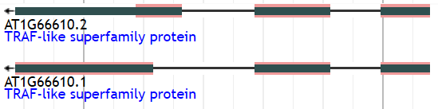
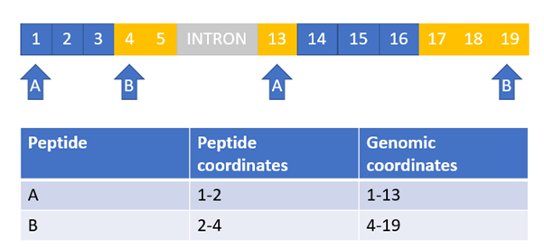
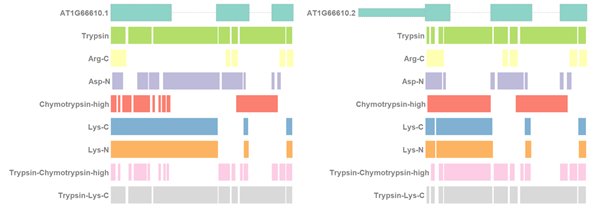
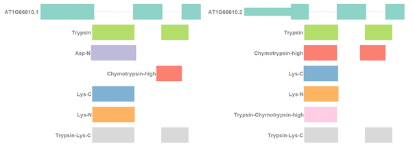

ProtView is able to provide possible peptides that can be identified by various digestion schemes, identify peptides that cover splice junctions, calculate sequence coverage percentage and junction coverage percentage, and convert peptide coordinates to genomic.

Figure 1: outline of the ProtView workflow

### Data acquisition
Araport11 Arabidopsis protein sequences were retrieved from the [tair database](https://www.arabidopsis.org/download/index-auto.jsp?dir=%2Fdownload_files%2FSequences%2FAraport11_blastsets) in fasta format and separated by chromosome and strand. The Araport11 GFF3 files were downloaded separately for each chromosome via [jbrowse](https://www.araport.org/data/araport11). AT1G66610 (Figure 2) is used as an example in this section to demonstrate how ProtView works.
 
 
Figure 2: Jbrowse depiction of AT1G66610

## ProtView Functions
ProtView is designed to present statistics of in silico digestions and provide useful information, such as the protein sequence coverage, peptides covering exon-exon junctions, and the percentage of junctions in the data that are covered by peptides of a digest (Figure 2). It allows the users to see the portions of the gene/transcript on the genome that are covered by proteomics data. It takes the protein sequence (fasta) and the coding sequence annotations (gff3 format) on the genome as inputs. It incorporates Rapid Peptides Generator (RPG) ([Maillet, 2019](https://academic.oup.com/nargab/article/2/1/lqz004/5581718), which carries out the in-silico digestion. It then maps the digested proteins back to transcripts/genes on the genome, which allows the comparisons of the transcript/ gene sequences visible to proteomics experiments between different digestions.

### PRG digest & output Processing
Digests were carried out in silico using Rapid Peptides Generator (RPG) ([Maillet, 2019](https://academic.oup.com/nargab/article/2/1/lqz004/5581718)). The Arabidopsis sequences were digested with Arg-C, Asp-N, Chymotrypsin-high, Glu-C, Lys-C, Lys-N, and Trypsin using default RPG settings in sequential mode, in addition to Trypsin/Asp-N, Trypsin/Lys-C and Trypsin/Chymotrypsin combinations in concurrent mode. Cleaving rules used by RPG for each enzyme can be found [here](https://rapid-peptide-generator.readthedocs.io/en/latest/enzymes.html#enzymes). Chymotrypsin-high specificity was selected over Chymotrypsin-low specificity in this in silico analysis because of its higher specificity.

RPG writes each set of in silico digest results into a new fasta file, that needs to be transformed into a csv table for the subsequent analysis to take place. Peptides containing stop codons or unknown peptides ('*', 'X') are also removed in this step to prevent downstream errors in the calculations. 

#### Miscleavage
RPG treats miscleavage as a percentage of how frequently cleavage is missed at each theoretical cleavage site. The purpose of these analyses is to allow in silico results to be compared to experimental data from software such as MaxQuant, where miscleavage is treated as the number of missed cleavages allowed per peptide. ProtView concatenates adjacent peptide sequences from the RPG digest up to n times, where n is the miscleavage number specified by the user. Molecular weight and isoelectric point are calculated for the concatenated peptides and the remaining information is copied. The resulting csv file is in the same format as the original processed RPG file. 

#### Parallel Digests
RPG has the option to carry out concurrent digests, where a sequence is cleaved by multiple enzymes. A protview function was written to combine peptides from individual digests carried out separately, creating parallel combinations. The function takes a processed rpg file and enzymes as input and returns a csv file of the peptides generated by the parallel digest. The enzyme name in the parallel digest output is the enzymes separated by ':', whereas the enzyme name for concurrent digests by RPG is the enzymes separated by '-'. Any duplicate peptides that are generated by more than one of the individual enzymes are removed from the parallel digest output.

#### Filtering
Peptides can be filtered by length and/ or residue, for peptides containing a specific amino acid. Alll digests in these analyses are filtered for a length of 7-35 amino acids, to cover the detection range of MS machinery.

Table 1: Example of a digested peptide after processing the digest results

| enzyme |	Cleavage position |	Peptide size |	Mol weight	| Isoelectric point	| sequence	| Peptide start	| parent |
|---|---|---|---|---|---|---|---|
|Trypsin | 13 | 10 | 1030.106 |	6.94| GTNAEQALAR | 4 | >AT1G66610.1 |

### GFF3 procesing
This step extracts coding sequence (CDS) information from gff3 files and prepares this information for the downstream analysis. The resulting tables retain relevant information from the original gff3 file, with the addition of relative protein sequence coordinates of the CDS start and end positions, unique CDS IDs, and the lengths and unique IDs of introns in between CDSs. Relative protein sequence coordinates are determined using the start position of the first CDS of each isoform and the intron lengths between CDSs of an isoform.  CDS and intron IDs consist of chromosome, start position, end position, and strand. Output from this step (Table 2) is saved as two csv files, one for each DNA strand.
Coding sequence (CDS) information for Arabidopsis was extracted from GFF3 format according to the workflow and the relative proteomic coordinates of each CDS were calculated successfully, when compared to the protein sequences.

Table 2: Format of CDSs after processing and extraction from GFF3 files.

| type |start | end | strand | Parent | CDS id | Intron id | Intron length | Protein | start | Protein end |
|---|---|---|---|---|---|---|---|---|---|---|
| CDS | 24850718 | 24851032	| - | AT1G66610.2 | Chr1\_24850718\_24851032\_- | Chr1\_24851033\_24851243\_- | 211 | 174 | 70 |

### Genomic co-ordinates
Relative peptide coordinates from the digest output are converted to the outer bounds of their corresponding coordinates on the genome, depending on the DNA strand and whether the position given is on the left- or right-hand side of the peptide (Figure 3). The conversion uses the genomic coordinates of the isoform that each peptide originates from and cumulative intron length, depending on the exon that the peptide position lies in from the processed gff3 table. Below are the equations used in this conversion for the positive strand, where isoform first start is the start position of the first CDS of the isoform and cumulative intron length is the total length of introns between the isoform start and the CDS that a protein position lies in.

genomic start position (LHS)=isoform first start +cumulative intron length+3*(protein position-1)
genomic end position (RHS)=isoform first start+cumulative intron length+3*(protein position-1)+2

In the figure below (Figure 3), peptides A and B each have the second amino acid as a coordinate, however the number given for the genomic coordinates differs between the peptides due to this amino acid representing a start and end position, and the script giving outer bounds of genomic positions.

Figure 3: Illustration example of peptide positions and their corresponding coordinates on the genome. The row of numbers represents nucleotides in the genome, with each 3 nucleotides corresponding to an amino acid in the protein sequence. 

The resulting data frame contains the parent isoform, both genomic and relative protein start and end positions for each peptide, and the enzymes used to generate the peptide (Table 3). For selected examples, the genomic coordinates of peptides were used to visualize isoform coverage on the genome with the R package Gviz ( [Hahne and Ivanek, 2016](https://link.springer.com/protocol/10.1007%2F978-1-4939-3578-9_16) (Figure 4).

Table 3: Output format of genomic coordinate conversion function on a single peptide

| isoform | Peptide start | Genomic start | Peptide end | Genomic end | enzyme | 
|---|---|---|---|---|---|
| AT1G66610.1 | 13 | 24851412 | 1 | 24851450 | Arg-C|

Figure 4: Gviz visualization of genome coverage for AT1G6610 using peptides in the 7-35 aa range. The first row shows the genome, thick coloured boxes are exons, thin boxes are UTRs, and dashed lines represent introns. Peptide sequence coverages by different proteases are in the following rows, with each protease/combination in a different colour. Peptides that appear to map to introns here span exon-exon junctions on the translated proteome. 

### Summary Statistics
The unfiltered RPG results are used to create a list of enzymes that were used in the digest. A table is then created with a row for each of these enzymes, allowing columns to be appended for the various calculations. The total number of peptides generated by each enzyme and their mean lengths are computed using the unfiltered RPG results and added to the table. The same is then done for the filtered RPG results, to give the number of peptides generated by each enzyme that made it through the filtering criteria. Sequence coverage percentage is calculated using the sum of peptide lengths in amino acids after filtering criteria have been applied and the sum of protein sequence lengths digested in silico. Residue coverage can be calculated for any amino acid and is the percentage of an amino acid in the input fasta file that is covered by peptides after filtering for length. The residue coverage feature cannot yet be used for paralllel enzyme combinations. Below are the summary statistics for AT1G66610, to exemplify the format of the output. 

Table 4: Summary statistics for AT1G66610

enzyme|total peptides|mean length|Peptides within 7-35aa  range|Protein sequence coverage %|K coverage|
-----|-----|-----|-----|-----|-----|
Arg-C|37|16.3|17|39.6|30
Asp-N|69|8.7|31|64.7|70
Chymotrypsin-high|45|13.4|26|54.4|60
Lys-C|32|18.8|19|54.4|56.7
Lys-N|32|18.8|19|54.7|63.3
Trypsin|65|9.3|36|87.7|60

### Isoform-unique peptides

### Junction-covering peptides & statistics
Aside from the general information above, another function of ProtView is to identify peptides that span exon-exon junctions, which is useful for identifying peptides that can be used to discriminate between isoforms. The default input for identifying junction-covering peptides is the filtered digest results, but this can be changed to the unfiltered results. The identification of peptides that cover exon-exon junctions is carried out separately for each strand, using junction position information from the processed gff3 files. Junctions are defined as the positions between CDSs of the same isoform. For every peptide in the digest results that originates from an isoform with junction information, a check is carried out to determine whether any junctions are positioned within the peptide. Positive outcomes are saved in the same format as the digest results, with an additional column for junction location (Table 5).

Table 5: Output format of junction spanning peptide identification function

Cleavage position|enzyme|Intron id|Isoelectric point|junction|Mol weight|parent|Peptide size|Peptide start|sequence
-----|-----|-----|-----|-----|-----|-----|-----|-----|-----
72|Trypsin|Chr1\_24851033\_24851243\_-|3.53|69.5|3086.641|>AT1G66610.2|28|45|SGTLFELDLLDCPICCNALTIPIFQCDK

Peptides that cover the first AT1G66610 exon and its adjacent junction for both isoforms in Figure 5 can be used to discriminate between the two AT1G66610 isoforms, because these exons are unique to each isoform. 

Figure 5: Gviz visualization of junction-covering peptides mapped back onto the genome for AT1G66610. The first  row shows the genome, thick coloured boxes are exons, thin boxes are UTRs, and dashed lines represent introns. Junction coverages by different proteases are in the following rows, coloured differently for each protease/ combination. Peptides that appear to cover introns here span exon-exon junctions on the translated proteome.

A summary table is generated from the junction-covering peptide results for each strand. Each table includes the number of junction-covering peptides generated by each enzyme, the number of unique junctions that an enzyme covers (to avoid double counting of splice junctions shared between transcripts), and a junction coverage percentage, which is the percentage of the total junctions available in the isoforms being examined that are covered by an enzyme. 

Table 6: Summary information for exon-exon covering peptides in the AT1G66610 example data

enzyme|Junction Spanning Peptides|Unique Junctions Covered|Total Junction Coverage %
-----|-----|-----|-----
Asp-N|1|1|25
Chymotrypsin-high|3|2|75
Lys-C|2|2|50
Lys-N|2|2|50
Trypsin|4|3|100
Trypsin-Chymotrypsin-high|1|1|25
Trypsin-Lys-C|4|3|100

