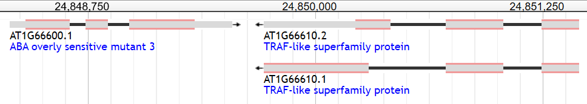

[](http://www.gnu.org/licenses/gpl-3.0)
# Table of Contents

* [Overview](#overview)
* [Installation](#installation)
* [Input files](#input-files)
* [Walk-through](#walk-through)
    * [RPG digest](#rpg-digest)
    * [Peptide Processing](#peptide-processing)
    * [Coding Sequence Extraction](#coding-sequence-extraction)
    * [General Summary Statistics](#general-summary-statistics)
    * [Genomic co-ordinate conversion](#genomic-co-ordinate-conversion)
    * [Exon-exon Junction Covering Peptide Identification & Summary Statistics](#junction-covering-peptides--statistics)
* [Contact](#contact)

# Overview
ProtView is designed to present statistics of in silico digestions and provide useful information, 
such as the protein sequence coverage, peptides covering exon-exon junctions, and the percentage 
of junctions or residues in the data that are covered by peptides of a digest (Figure 1). It allows 
the users to see the portions of the gene/transcript on the genome that are covered by proteomic 
data. It takes the protein sequence (fasta) and the coding sequence annotations (gff3 format) on 
the genome as inputs. It incorporates Rapid Peptides Generator (RPG) 
([Maillet, 2019](https://academic.oup.com/nargab/article/2/1/lqz004/5581718)), which carries out 
the in-silico digestion. It then maps the digested proteins back to transcripts/genes on the genome, 
which allows the comparisons of the transcript/ gene sequences visible to proteomics experiments 
between different digestions.


**Figure 1:** outline of the ProtView workflow

# Installation
Supported Python version: 3.7.4

ProtView requires the following packages:
* [rpg](https://rapid-peptide-generator.readthedocs.io/en/latest/userguide.html#installation) version 1.1.0
* [pandas](https://pandas.pydata.org/pandas-docs/stable/getting_started/install.html?highlight=install) version 0.25.1
* [gffpandas](https://gffpandas.readthedocs.io/en/latest/installation.html) version 1.2.0
* [numpy](https://numpy.org/install/) version 1.16.5
* [BioPython](https://biopython.org/wiki/Download) version 1.76

The zip file can be downloaded from this github repository. Once downloaded, the working directory needs to be set to
the ProtView directory that contains this README and the scripts.

# Input Files
Required input for an analysis with ProtView:
* Protein sequence(s) in fasta format
* Corresponding gff3 file(s)

Any additional input required for downstream functions is generated by ProtView during the analysis.

# Walk-through
The *Arabidopsis thaliana* genes AT1G666600 and AT1G66610 (Figure 2) are used as an example to 
demonstrate how ProtView works. Araport11 protein sequences were retrieved from the 
[tair database](https://www.arabidopsis.org/download/index-auto.jsp?dir=%2Fdownload_files%2FSequences%2FAraport11_blastsets) 
in fasta format and the Araport11 GFF3 files were downloaded via [jbrowse](https://www.araport.org/data/araport11).
These files can be found in the example_data folder.



**Figure 2:** Jbrowse depiction of AT1G66610

## RPG digest
ProtView incorporates Rapid Peptides Generator (RPG) ([Maillet, 2019](https://academic.oup.com/nargab/article/2/1/lqz004/5581718))
to carry out *in-silico* digests. RPG takes a fasta protein sequence as input, more instructions for 
running RPG can be found [here](https://rapid-peptide-generator.readthedocs.io/en/latest/).

In this example, the proteins were digested with trypsin, lys-c, and asp-n in sequential mode. RPG can 
carry out digests in sequential or concurrent mode, where a sequence is cleaved by multiple enzymes. 
ProtView can then combine peptides from sequential digests, creating parallel enzyme combinations.

`rpg -i example_data\at1g66600_at1g66610.fasta -o example_data\at1g66600_at1g66610_rpg.fasta -e 42 2 28 -q`

The output is saved as 'at1g66600_at1g66610_rpg.fasta' in the example_data folder.

## Peptide Processing
Processes RPG-generated peptides in fasta format, allows the user to specify the number of missed cleavages 
allowed per peptide, create parallel enzyme digests, and filter for peptides containing a specific residue
or of a certain amino acid length.

Required Arguments:
* **input_file**: name of the RPG peptides file

Options:
* **-mc, --miscleavage**:  Mis-cleavage value, default = 0
* **-e, --enzymes**: Enzymes to create a parallel digest with, default = none
* **-r, --residue**: Residue to be filtered for, default = none
* **-min, --min_len**: Minimum peptide length to filter for, default = 7
* **-max, --max_len**: Maximum peptide length to filter for, default = 35

The options are carried out in the order in which they are given here and the output is saved after
each step.

To process the RPG peptides generated above, allowing for no missed cleavages, creating a parallel digest
of Trypsin and Asp-N, and filtering for the default 7-35 amino acid length range:

`python rpg_output_processing_parser.py example_data\at1g66600_at1g66610_rpg.fasta -e Trypsin Asp-N`

Note that this filters the parallel digest. To filter the individual enzyme digests, it must 
be ran again without the parallel digest option.

`python rpg_output_processing_parser.py example_data\at1g66600_at1g66610_rpg.fasta`

## Coding Sequence Extraction
Extracts coding sequence (CDS) information from gff3 files and prepares this information for the 
downstream analysis. The resulting tables retain relevant information from the original gff3 file, with 
the addition of relative protein sequence coordinates of the CDS start and end positions, unique CDS IDs, 
and the lengths and unique IDs of introns in between CDSs. Relative protein sequence coordinates are 
determined using the start position of the first CDS of each isoform and the intron lengths between CDSs 
of an isoform.  CDS and intron IDs consist of chromosome, start position, end position, and strand.

Required Arguments:
* **input_file**: input file name of gff3 file

To extract CDS information from the gff3 file for the example Arabidopsis proteins:

`python cds_extraction_parser.py example_data\at1g66600_at1g66610.gff3`

The resulting CDS information is saved separately for each strand in csv format 
('at1g66600_at1g66610_+\_cdsdf.csv, at1g66600_at1g66610\_-_cdsdf.csv,')

Note that ProtView will generate a CDS information file for each DNA strand, regardless of whether the input only 
contains protein(s) on one of the strands. It is important to keep empty CDS information files generated, as they 
are required as input for steps in the downstream analysis.

## General Summary Statistics
This gives a table with columns for the total number of peptides generated, both before and after 
filtering criteria were applied, peptide length distributions, and protein sequence coverage. The 
calculation of residue coverage is optional and carried out if residues are provided by the user.

Required Arguments:
* **-fasta, --fasta_files**: original fasta sequence files used in the digests
* **-u, --unfiltered_rpg_files**: unfiltered rpg peptides in csv format
* **-f, --filtered_rpg_files**: filtered rpg peptides in csv format

Optional Arguments:
* **-o, --output_name**: name of the output file, ending in .csv. Default = summary_table.csv
* **-r, --residues**: residues to calculate coverage for

To generate summary statistics of the example data for the individual and parallel digests and include
Cysteine (C) coverage:

```
python summary_table_parser.py -fasta example_data\at1g66600_at1g66610.fasta 
-u example_data\at1g66600_at1g66610_rpg.csv example_data\at1g66600_at1g66610_rpg_parallel.csv 
-f example_data\at1g66600_at1g66610_rpg_len_7_35.csv example_data\at1g66600_at1g66610_rpg_parallel_len_7_35.csv 
-r C -o example_data\at1g66600_at1g66600_summary.csv
```


## Genomic co-ordinate conversion
Relative peptide coordinates from the digest output are converted to the outer bounds of their 
corresponding coordinates on the genome. The resulting table contains the isoform, both genomic and 
relative protein start and end positions for each peptide, and the enzymes used to generate the peptide. 

This function works best on one protein at a time and the output allows for genomic coverage visualization using
tools such as [Gviz](https://link.springer.com/protocol/10.1007%2F978-1-4939-3578-9_16).

Arguments:
* **rpg_file**: csv file containing the peptides and their proteomic co-orindates
* **cds_files**: both csv files containing extracted coding sequences for each DNA strand, ending in 
+/-_cdsdf.csv

```
python gen_coords_parser.py example_data\at1g66600_at1g66610_rpg_len_7_35.csv example_data\at1g66600_at1g66610_+_cdsdf.csv 
example_data\at1g66600_at1g66610_-_cdsdf.csv
```

## Junction-covering peptides & statistics
Peptides are filtered for those that cover eon-exon junctions. The recommended input for identifying 
junction-covering peptides is the filtered digest results. Positive outcomes are saved in the same csv 
format as the digest results, with an additional column for junction location.

Arguments:
* **rpg_file**: csv file containing the peptides to be filtered
* **cds_files**: both csv files containing extracted coding sequences for each DNA strand, ending in 
+/-_cdsdf.csv
* **output_name**: desired name of output csv file, ProtView will automatically differentiate between 
DNA strands

```
# to filter the individual digests
python junction_spanning_parser.py example_data\at1g66600_at1g66610_rpg_len_7_35.csv 
example_data\at1g66600_at1g66610_+_cdsdf.csv example_data\at1g66600_at1g66610_-_cdsdf.csv 
example_data\junction_peptides.csv

# to filter the parallel digest, first argument changes to the csv containing peptides from this digest
python junction_spanning_parser.py example_data\at1g66600_at1g66610_rpg_parallel_len_7_35.csv 
example_data\at1g66600_at1g66610_+_cdsdf.csv example_data\at1g66600_at1g66610_-_cdsdf.csv 
example_data\junction_peptides.csv
```
Note that by giving 'junction_peptides.csv' as the output argument, ProtView adds '\_+\_' or '\_-\_' to the 
end to distinguish between strands, resulting in files named 'junction_peptides_+\_.csv' and 
'junction_peptides_-_.csv'

A summary table can be generated from the junction-covering peptide results for each strand. Each table 
includes the number of junction-covering peptides generated by each enzyme, the number of unique junctions 
that an enzyme covers (to avoid double counting of splice junctions shared between transcripts), and a 
junction coverage percentage, which is the percentage of the total junctions available in the isoforms 
being examined that are covered by an enzyme. 

Arguments:
* **-pept, --junction_spanning_peptides**: csv files containing the junction covering peptides
* **-cds, --cds_files**: both csv files containing extracted coding sequences for each DNA strand, 
ending in +/-_cdsdf.csv
* **-out, --output_name**: desired name of output csv summary file, default: junction_summary.csv

To summarise the junction-covering peptides in the example data digests:
```
python junction_summary_stats_parser.py -pept example_data\junction_peptides_+_.csv example_data\junction_peptides_-_.csv 
example_data\parallel_junction_peptides_+_.csv example_data\parallel_junction_peptides_-_.csv -cds 
example_data\at1g66600_at1g66610_+_cdsdf.csv example_data\at1g66600_at1g66610_-_cdsdf.csv -out 
example_data\junction_summary.csv
```

# Contact
For further information please contact <SSPuliasi@dundee.ac.uk>